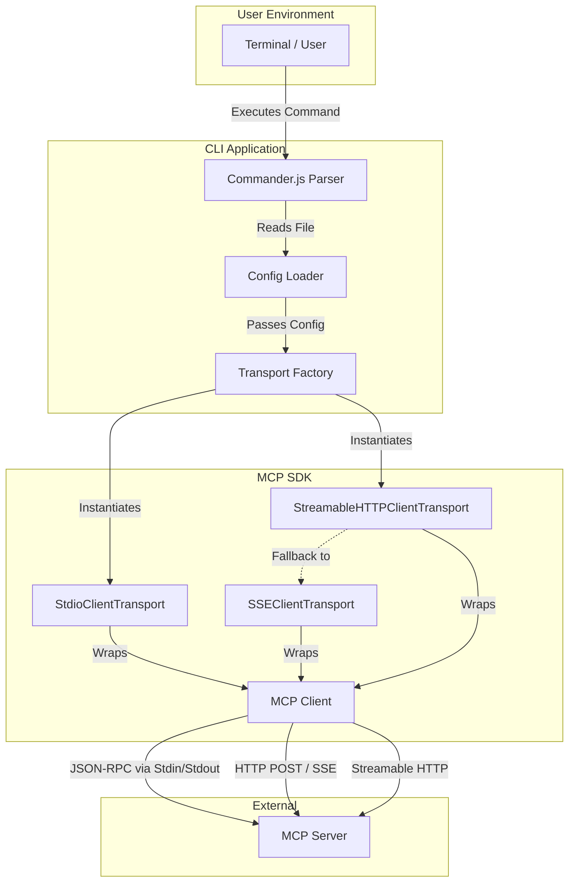
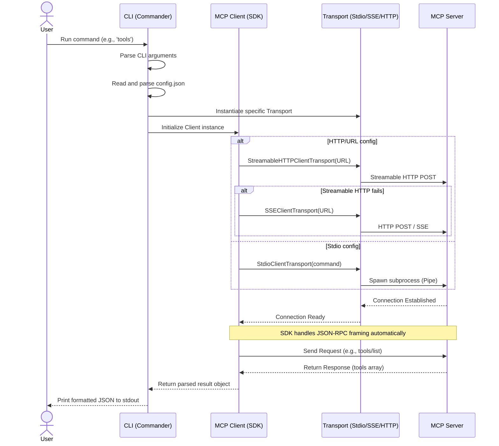
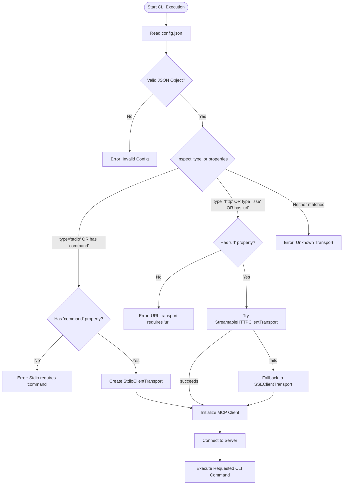

# MCP CLI

A command-line interface for interacting with Model Context Protocol (MCP) servers using the official `@modelcontextprotocol/sdk`. This tool is designed to be lightweight, type-safe, and strictly focused on connecting to a single MCP server per configuration file.

## Features

- Supports **stdio**, **SSE (Server-Sent Events)**, and **HTTP Streamable** transport mechanisms. When `type` is omitted, the CLI auto-detects: tries Streamable HTTP first, then falls back to legacy SSE. When `type` is explicitly set to `"http"` or `"sse"`, only the specified transport is used.
- Built with pure TypeScript for type safety and reliability.
- Minimal, flat configuration schema requiring no nested wrappers.
- Standardized CLI interface powered by Commander.js.
- Optional daemon mode for persistent cross-invocation sessions (HTTP, SSE, and stdio).
- Pre-built standalone binaries for Windows, macOS, and Linux (via Bun `--compile`).
- Configurable output format: `json` (default, machine-parseable) or `text` (human-readable plain text).
- Optional de-duplication and optimization flags to remove redundant or duplicate results from MCP server responses.
- Cancellation support: pressing `Ctrl+C` during an in-flight request cleanly closes the MCP connection and exits with code `1`, preventing stuck sessions.
- Observable logging with configurable `--log-level` (`silent`, `error`, `warn`, `info`, `debug`) and structured `[mcp-cli]`-prefixed log output to stderr.
- Standard exit codes: `0` for success, `1` for any error — suitable for scripting and CI.
- Version number sourced from `package.json` at runtime — no hardcoded version strings, automatically injected into the MCP client handshake.
- JSONPath-lite `--select <expr>` to extract specific parts of results without requiring `jq`.
- Client-side policy guards: `autoApprove`, `denyTools`, `denyResourcePatterns`, and `maxPayloadBytes` — configured in the config file.

## High-Level Architecture

This component diagram illustrates the separation of concerns between the CLI parsing, the official SDK, the transport layer, and the external MCP server.



## Execution Flow (Sequence Diagram)

This sequence diagram details the step-by-step interaction when a user executes a command, highlighting how the SDK abstracts the underlying transport and JSON-RPC protocol.



## Configuration Resolution Flowchart

This flowchart demonstrates the decision-making logic inside the CLI when determining which transport to instantiate based on the flat configuration schema.



## Prerequisites

- Node.js version 22.0.0 or higher.
- yarn, npm, or pnpm (yarn is recommended — the project ships with a `yarn.lock`).

## Installation

1. Clone the repository or download the source files.
2. Install dependencies:
   ```bash
   yarn install
   ```
   Or with npm:
   ```bash
   npm install
   ```
3. Build the TypeScript source code:
   ```bash
   yarn build
   ```
   Or:
   ```bash
   npm run build
   ```

## Available Scripts

| Command                                | Description                                                               |
| -------------------------------------- | ------------------------------------------------------------------------- |
| `yarn build` / `npm run build`         | Compile TypeScript source to `./dist/`                                    |
| `yarn typecheck` / `npm run typecheck` | Check TypeScript types without emitting output (`tsc --noEmit`).          |
| `yarn lint` / `npm run lint`           | Run ESLint across all TypeScript files                                    |
| `yarn start` / `npm start`             | Run `node dist/cli.js` (requires build)                                   |
| `yarn package`                         | Build standalone binaries for all platforms (output: `./build/Release/`). |
| `yarn package:windows`                 | Build a standalone binary for Windows x64 (output: `./build/Release/`).   |

## Configuration

The CLI requires a JSON configuration file defining a single MCP server. The configuration must be a flat object without any wrapper keys.

The config object supports the following fields:

| Field                  | Type       | Required     | Description                                                                                     |
| ---------------------- | ---------- | ------------ | ----------------------------------------------------------------------------------------------- |
| `type`                 | `string`   | No           | Transport type: `"stdio"`, `"sse"`, or `"http"`. Auto-detected from other properties if absent. |
| `command`              | `string`   | For stdio    | The executable to spawn (e.g., `"npx"`).                                                        |
| `args`                 | `string[]` | No           | Arguments passed to the command.                                                                |
| `env`                  | `object`   | No           | Additional environment variables merged on top of `process.env`.                                |
| `url`                  | `string`   | For SSE/HTTP | The server endpoint URL (e.g., `"http://localhost:3001/sse"`).                                  |
| `autoApprove`          | `string[]` | No           | Glob patterns for tool names allowed without restriction. Empty/default = all tools allowed.    |
| `denyTools`            | `string[]` | No           | Glob patterns for tool names that are never allowed. Takes precedence over `autoApprove`.       |
| `denyResourcePatterns` | `string[]` | No           | Glob patterns for resource URI patterns that are never allowed.                                 |
| `maxPayloadBytes`      | `number`   | No           | Maximum response payload size in bytes (default: 10485760, i.e. 10 MB).                         |

### Example: Stdio Transport (Recommended for Quick Start)

Create a file named `config.json`:

```json
{
  "command": "npx",
  "args": ["-y", "@modelcontextprotocol/server-everything"],
  "env": {}
}
```

This configuration launches the reference `server-everything` server via `npx`, which exposes a comprehensive set of demo tools, resources, and capabilities for testing.

The `env` field is merged with the current process environment. Any variables in `env` will override those in `process.env`.

### Example: SSE Transport

```json
{
  "type": "sse",
  "url": "http://localhost:3001/sse"
}
```

### Example: HTTP Streamable Transport

```json
{
  "type": "http",
  "url": "http://localhost:3001/mcp"
}
```

The transport selection logic depends on the `type` field:

- **`"type": "sse"`** → Uses `SSEClientTransport` directly.
- **`"type": "http"`** → Uses `StreamableHTTPClientTransport` directly (no fallback).
- **No `type` set** → Auto-detect mode: tries `StreamableHTTPClientTransport` first; if it fails, falls back to `SSEClientTransport`. If both fail, the CLI reports both errors.

## Usage

All commands require the `-c` or `--config` flag pointing to your configuration file. The examples below use the [server-everything](https://github.com/modelcontextprotocol/servers/tree/main/src/everything) reference server.

### List Available Tools

Retrieve a list of all tools exposed by the connected MCP server.

```bash
node dist/cli.js -c config.json tools
```

Example output (abbreviated):

```
[
  {
    "name": "echo",
    "title": "Echo Tool",
    "description": "Echoes back the input string",
    "inputSchema": {
      "properties": {
        "message": { "type": "string" }
      },
      "required": ["message"]
    }
  },
  {
    "name": "get-sum",
    "title": "Get Sum Tool",
    "description": "Returns the sum of two numbers",
    "inputSchema": {
      "properties": {
        "a": { "type": "number" },
        "b": { "type": "number" }
      },
      "required": ["a", "b"]
    }
  },
  {
    "name": "simulate-research-query",
    "title": "Simulate Research Query",
    "description": "Simulates a deep research operation..."
  },
  ...
]
```

### List Available Resources

Retrieve a list of all resources exposed by the connected MCP server.

```bash
node dist/cli.js -c config.json resources
```

### Call a Tool

Execute a specific tool provided by the server. Pass arguments as a JSON string using the `-a` or `--args` flag.

```bash
node dist/cli.js -c config.json call echo -a '{"message": "Hello, MCP World!"}'
```

Example output:

```json
{
  "content": [
    {
      "type": "text",
      "text": "Hello, MCP World!"
    }
  ]
}
```

Call a numeric tool:

```bash
node dist/cli.js -c config.json call get-sum -a '{"a": 5, "b": 3}'
```

```json
{
  "content": [
    {
      "type": "text",
      "text": "8"
    }
  ]
}
```

### Read a Resource

Fetch the contents of a specific resource by its URI.

```bash
node dist/cli.js -c config.json read "demo://resource/static/document/how-it-works.md"
```

## Quoting on Windows Command Prompt

Command Prompt treats quotes and special characters differently from PowerShell, so JSON passed inline can be split into multiple arguments before it reaches the CLI. If you see `too many arguments for 'call'` when using `-a`, escape the JSON by wrapping the entire value in double quotes and escaping the inner quotes:

```cmd
rem Escape inner quotes
node dist\cli.js -c config.json call echo -a "{\"message\": \"Hello, MCP World!\"}"
```

### Notes

- Use `cmd` escaping, not PowerShell escaping.
- If the CLI still splits the payload, put the JSON in a file and pass the file path instead.
- This is the most reliable approach on `cmd.exe` for nested JSON arguments.

## Quoting on Windows PowerShell

PowerShell interprets a leading `{` as the start of a script block, which strips braces and mangles JSON before it reaches the CLI. If you see `too many arguments for 'call'` when using `-a`, escape the JSON:

```powershell
# Escape inner quotes
node dist/cli.js -c config.json call echo -a '{\"message\": \"Hello, MCP World!\"}'
```

## Daemon Mode (Stateful Sessions)

By default, every command spawns a fresh lifecycle (connect, handshake, execute, teardown). For repeated commands against the same server, start a background daemon to persist the session.

**1. Start the daemon**

```bash
node dist/cli.js -c config.json --daemon
```

The daemon binds to a local platform socket derived from the SHA-256 hash of the resolved config file path:

- **Unix**: `$XDG_RUNTIME_DIR/mcp-cli-{hash16}.sock` (falls back to `tmpdir()/mcp-cli-{uid}/mcp-cli-{hash16}.sock`)
- **Windows**: `\\.\pipe\mcp-cli-{hash16}` (named pipe)

On Unix, the socket directory is created with `chmod 0700` and the socket file is restricted to the current user with `chmod 0600` after binding. When falling back from `$XDG_RUNTIME_DIR`, a UID-scoped directory is created under the system temp directory.

It handshakes once with the MCP server and stays alive.

**2. Execute stateful commands**
Use the `-s` or `--stateful` flag to route commands through the running daemon. No new connection or handshake is performed.

```bash
node dist/cli.js -c config.json -s tools
node dist/cli.js -c config.json -s call echo -a '{"message": "Hello, MCP World!"}'
node dist/cli.js -c config.json -s read "demo://resource/static/document/how-it-works.md"
```

If the daemon is not running, `-s` exits with exit code `1` and an error message.

**Daemon lifecycle:**

- The daemon automatically shuts down after **6 minutes of inactivity** (hardcoded — not configurable) and cleans up its socket file (Unix only; Windows named pipes are managed by the OS).
- It shuts down gracefully on `SIGINT` or `SIGTERM`, closing the MCP client connection and removing the Unix socket file before exiting.

## Output Formats

All commands accept the `-f` or `--format` global option to control how results are displayed:

| Format | Description                                                           |
| ------ | --------------------------------------------------------------------- |
| `json` | **(Default)** Pretty-printed JSON, suitable for scripting and piping. |
| `text` | Human-readable plain text with labels, indentation, and descriptions. |

### Examples

List tools in JSON format (default):

```bash
node dist/cli.js -c config.json -f json tools
```

List tools in human-readable text format:

```bash
node dist/cli.js -c config.json -f text tools
```

Example text output:

```
Available Tools:

  echo
    Title: Echo Tool
    Description: Echoes back the input string
    Arguments:
      message (string) [required] — The message to echo

  get-sum
    Title: Get Sum Tool
    Description: Returns the sum of two numbers
    Arguments:
      a (number) [required]
      b (number) [required]
```

Call a tool with text output:

```bash
node dist/cli.js -c config.json -f text call echo -a '{"message": "Hello, MCP World!"}'
```

Output:

```
Hello, MCP World!
```

## Logging & Observability

The CLI supports configurable log levels via the `--log-level` global option:

| Level    | Description                                                                      |
| -------- | -------------------------------------------------------------------------------- |
| `silent` | No log output to stderr at all.                                                  |
| `error`  | Only error messages.                                                             |
| `warn`   | Errors and warnings.                                                             |
| `info`   | **(Default)** Informational messages (startup, shutdown, optimization reports).  |
| `debug`  | Detailed debug messages (client initialization, transport selection, MCP calls). |

All log output is written to **stderr** with a `[mcp-cli] [LEVEL]` prefix, keeping stdout clean for JSON/text results.

### Examples

```bash
# Only show errors
node dist/cli.js -c config.json --log-level error tools

# Enable debug logging to see client initialization and transport selection
node dist/cli.js -c config.json --log-level debug call echo -a '{"message": "hello"}'

# Silent mode — no stderr output at all
node dist/cli.js -c config.json --log-level silent tools
```

## Cancellation (Ctrl+C)

When you press `Ctrl+C` while a command is in-flight, the CLI performs a clean shutdown:

1. The active MCP client connection is closed immediately, which causes any pending SDK request to reject.
2. After a 500ms grace period for cleanup to settle, the process exits with code `1`.
3. No orphaned sessions or stuck transports are left behind.

The daemon mode (`--daemon`) handles SIGINT/SIGTERM by closing the MCP client, destroying all active socket connections, and removing the Unix socket file before exiting.

## Output Optimization

Some MCP servers return duplicate or redundant results — for example, returning the same structured data both as `structuredContent` and as a legacy JSON string in `content[]`. The CLI provides opt-in flags to mitigate this at the output level.

| Flag                 | Default | Description                                                                              |
| -------------------- | ------- | ---------------------------------------------------------------------------------------- |
| `--optimize`         | off     | Remove redundant legacy JSON text blocks when they are identical to `structuredContent`. |
| `--dedupe`           | off     | Deduplicate items in result arrays using the specified key mode.                         |
| `--dedupe-by <mode>` | `exact` | Deduplication key strategy: `exact`, `auto`, `url`, `uri`, or `id`.                      |
| `--optimize-report`  | off     | Print optimization/dedup removal statistics to stderr (keeps stdout clean).              |

**`--dedupe-by` modes:**

| Mode    | Behavior                                                                                           |
| ------- | -------------------------------------------------------------------------------------------------- |
| `exact` | Deduplicate by full JSON structural equality (default — safest).                                   |
| `auto`  | Deduplicate by `url` → `uri` → `id` field in order (falls back to exact). Best for search results. |
| `url`   | Deduplicate by `url` field.                                                                        |
| `uri`   | Deduplicate by `uri` field.                                                                        |
| `id`    | Deduplicate by `id` field.                                                                         |

**Notes:**

- These flags are **client-side only** — they modify the output just before printing, with no changes to the underlying MCP protocol.
- `--optimize` is **low risk**: it only removes a text block when it is provably deep-equal to `structuredContent`. This aligns with the MCP spec's structured-content guidance.
- `--dedupe auto` is **heuristic**: it can collapse items that share the same URL/URI/ID but have different content. Use `--dedupe-by exact` if you only want to remove structurally identical items.
- All flags default to **off**, preserving existing behavior.

### Examples

```bash
# Remove redundant JSON text blocks that duplicate structuredContent
node dist/cli.js -c config.json --optimize call echo -a '{"message": "hello"}'

# Deduplicate tool list by exact structural match
node dist/cli.js -c config.json --dedupe tools

# Deduplicate search results by url field with report
node dist/cli.js -c config.json --dedupe --dedupe-by url --optimize-report call search -a '{"query": "RAG"}'

# Combine all optimizations
node dist/cli.js -c config.json --optimize --dedupe --dedupe-by exact tools
```

## Selectors

The `--select <expr>` option lets you extract specific parts of a result using a lightweight dot-path syntax — no `jq` required.

| Expression        | Behavior                                             |
| ----------------- | ---------------------------------------------------- |
| `tools`           | Top-level property access.                           |
| `content[0].text` | Array index access + nested property.                |
| `contents[*].uri` | Map over array elements, extracting `uri` from each. |
| `tools[*].name`   | Extract all tool names.                              |
| `uri`             | Simple key on a resource result.                     |

### Examples

```bash
# Extract only the names from a tool list
node dist/cli.js -c config.json --select "tools[*].name" tools

# Get only the text content of the first result block
node dist/cli.js -c config.json --select "content[0].text" call echo -a '{"message": "hello"}'

# Extract URIs from resource list
node dist/cli.js -c config.json --select "contents[*].uri" read "demo://resource/static/document/how-it-works.md"
```

The selector is applied after all other processing (optimize, dedupe) and before formatting. If the expression returns no results, a warning is logged but no output is printed.

## Policy Guards (Safety Rails)

Policy guards are configured directly in the config file alongside server connection settings. They provide client-side enforcement for tool execution and resource access.

| Field                  | Type       | Description                                                                                 |
| ---------------------- | ---------- | ------------------------------------------------------------------------------------------- |
| `autoApprove`          | `string[]` | Tool name glob patterns allowed without restriction. Empty = all tools allowed (open mode). |
| `denyTools`            | `string[]` | Tool name glob patterns that are never allowed. Overrides `autoApprove`.                    |
| `denyResourcePatterns` | `string[]` | Resource URI glob patterns that are never allowed.                                          |
| `maxPayloadBytes`      | `number`   | Maximum response payload size (default: 10485760, i.e. 10 MB).                              |

Glob patterns support `*` (matches any non-slash characters) and `**` (matches any characters including `/`).

### Example: Restricted Config

```json
{
  "command": "npx",
  "args": ["-y", "@modelcontextprotocol/server-everything"],
  "autoApprove": ["echo", "get-*"],
  "denyTools": ["dangerous-tool"],
  "denyResourcePatterns": ["secret://*"],
  "maxPayloadBytes": 5242880
}
```

When this config is used:

- `echo` and `get-sum` are allowed (match `autoApprove` patterns)
- Any tool named `dangerous-tool` is denied before the request is sent
- Any resource URI starting with `secret://` is denied before the request is sent
- Responses larger than 5 MB are blocked with a policy error
- All other tools not in `autoApprove` are blocked with a descriptive error

### Global Help

View all available commands and options.

```bash
node dist/cli.js --help
```

## Development

To build and run from the TypeScript source:

```bash
yarn build
node dist/cli.js -c config.json tools
```

To lint the codebase:

```bash
yarn lint
```

Or run TypeScript type checking (uses `tsc --noEmit` to check types without emitting output files):

```bash
yarn typecheck
```

## Building Standalone Binaries

Requires [Bun](https://bun.sh) on the build machine. End users do not need Node.js installed.

```bash
# Build for all platforms
node scripts/package.js --all

# Build for specific platforms
node scripts/package.js --windows-x64 --linux-x64 --darwin-arm64
```

The project's `package.json` scripts (`yarn package`, `yarn package:windows`) use `--outdir ./build/Release`. When running `node scripts/package.js` directly, binaries are written to `./dist-bin/` by default. Use `--outdir <path>` to override.

The `.yarnrc.yml` file configures cross-platform architecture support (`win32`, `linux`, `darwin` / `x64`, `arm64`) for Yarn, which is required when installing dependencies for multi-platform binary packaging.

### Pre-built Binaries

Pre-built binaries for supported platforms may already be present in the `build/Release/` directory (or downloaded from [GitHub Releases](https://github.com/ahmadmdabit/mcp-cli/releases)). These require no Node.js or Bun installation and can be used directly.

## Continuous Integration

The repository includes a [GitHub Actions workflow](.github/workflows/release.yml) that:

1. Runs linting and TypeScript type checking on every push and pull request.
2. Builds TypeScript and packages standalone binaries for all 5 supported platforms in a single job via `yarn package` (internally `scripts/package.js --all`), which uses Bun's cross-compilation (`bun build --compile --target=...`) to produce all platform binaries from one runner.
3. Creates a GitHub release with all binaries and SHA-256 checksums when a tag matching `v*.*.*` is pushed.

## License

MIT [LICENSE](LICENSE)
