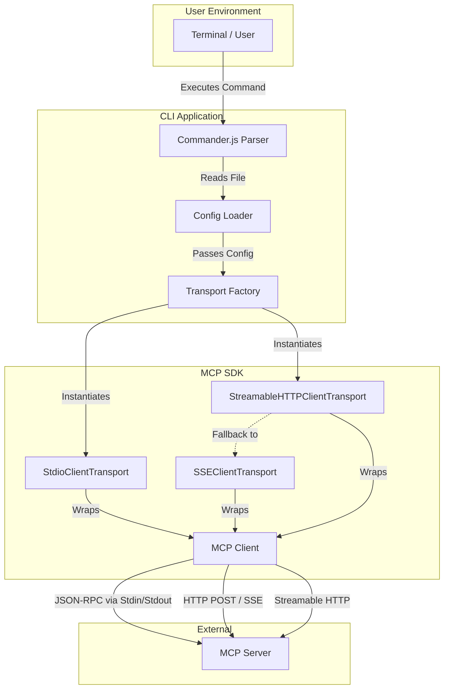
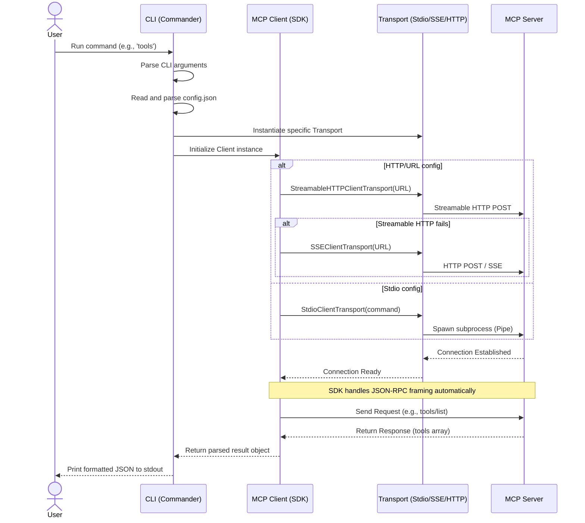

# MCP CLI

A command-line interface for interacting with Model Context Protocol (MCP) servers using the official `@modelcontextprotocol/sdk`. This tool is designed to be lightweight, type-safe, and strictly focused on connecting to a single MCP server per configuration file.

## Features

- Supports **stdio**, **SSE (Server-Sent Events)**, and **HTTP Streamable** transport mechanisms. When `type` is omitted, the CLI auto-detects: tries Streamable HTTP first, then falls back to legacy SSE. When `type` is explicitly set to `"http"` or `"sse"`, only the specified transport is used.
- Built with pure TypeScript for type safety and reliability.
- Minimal, flat configuration schema requiring no nested wrappers.
- Standardized CLI interface powered by Commander.js.
- Optional daemon mode for persistent cross-invocation sessions (HTTP, SSE, and stdio).
- Pre-built standalone binaries for Windows, macOS, and Linux (via Bun `--compile`).
- Configurable output format: `json` (default, machine-parseable) or `text` (human-readable plain text).
- Optional de-duplication and optimization flags to remove redundant or duplicate results from MCP server responses.
- Cancellation support: pressing `Ctrl+C` during an in-flight request cleanly closes the MCP connection and exits with code `1`, preventing stuck sessions.
- Observable logging with configurable `--log-level` (`silent`, `error`, `warn`, `info`, `debug`) and structured `[mcp-cli]`-prefixed log output to stderr.
- Standard exit codes: `0` for success, `1` for any error — suitable for scripting and CI.
- Version number sourced from `package.json` at runtime — no hardcoded version strings, automatically injected into the MCP client handshake.
- JSONPath-lite `--select <expr>` to extract specific parts of results without requiring `jq`.
- Client-side policy guards: `autoApprove`, `denyTools`, `denyResourcePatterns`, and `maxPayloadBytes` — configured in the config file.

## High-Level Architecture

This component diagram illustrates the separation of concerns between the CLI parsing, the official SDK, the transport layer, and the external MCP server.



## Execution Flow (Sequence Diagram)

This sequence diagram details the step-by-step interaction when a user executes a command, highlighting how the SDK abstracts the underlying transport and JSON-RPC protocol.



## Configuration Resolution Flowchart

This flowchart demonstrates the decision-making logic inside the CLI when determining which transport to instantiate based on the flat configuration schema.


## Quick Start (Pre-built Binaries)

No Node.js or development tools required. Download a standalone binary for your OS — it's a single file, ready to run.

### Download Latest Release

Each platform has a standalone binary and a compressed archive. Windows uses `.zip`; Linux and macOS use `.tar.gz`. SHA-256 checksums are provided for every file.

| Platform                        | Archives                                                                                                                                                                                                                                      |
| ------------------------------- | --------------------------------------------------------------------------------------------------------------------------------------------------------------------------------------------------------------------------------------------- |
| **Windows** (x64)               | [`mcp-cli-windows-x64.exe`](https://github.com/ahmadmdabit/mcp-cli/releases/latest/download/mcp-cli-windows-x64.exe) · [`mcp-cli-windows-x64.zip`](https://github.com/ahmadmdabit/mcp-cli/releases/latest/download/mcp-cli-windows-x64.zip)   |
| **Linux** (x64)                 | [`mcp-cli-linux-x64`](https://github.com/ahmadmdabit/mcp-cli/releases/latest/download/mcp-cli-linux-x64) · [`mcp-cli-linux-x64.tar.gz`](https://github.com/ahmadmdabit/mcp-cli/releases/latest/download/mcp-cli-linux-x64.tar.gz)             |
| **Linux** (ARM64)               | [`mcp-cli-linux-arm64`](https://github.com/ahmadmdabit/mcp-cli/releases/latest/download/mcp-cli-linux-arm64) · [`mcp-cli-linux-arm64.tar.gz`](https://github.com/ahmadmdabit/mcp-cli/releases/latest/download/mcp-cli-linux-arm64.tar.gz)     |
| **macOS** (Apple Silicon / M1+) | [`mcp-cli-darwin-arm64`](https://github.com/ahmadmdabit/mcp-cli/releases/latest/download/mcp-cli-darwin-arm64) · [`mcp-cli-darwin-arm64.tar.gz`](https://github.com/ahmadmdabit/mcp-cli/releases/latest/download/mcp-cli-darwin-arm64.tar.gz) |
| **macOS** (Intel)               | [`mcp-cli-darwin-x64`](https://github.com/ahmadmdabit/mcp-cli/releases/latest/download/mcp-cli-darwin-x64) · [`mcp-cli-darwin-x64.tar.gz`](https://github.com/ahmadmdabit/mcp-cli/releases/latest/download/mcp-cli-darwin-x64.tar.gz)         |

See the [full changelog](https://github.com/ahmadmdabit/mcp-cli/releases/latest) on GitHub Releases for version history and release notes.

> **💡 Tip: Use the compressed archive to avoid OS security warnings.**
> When you download a raw executable (`.exe`, or a binary with no extension), your operating system may show a security warning because the file isn't digitally signed:
>
> - **Windows SmartScreen** — "Windows protected your PC" / "Unrecognized app"
> - **macOS Gatekeeper** — "cannot be opened because the developer cannot be verified"
> - **Linux browsers** — may flag the download as potentially unsafe
>
> **The compressed archives (`.zip` / `.tar.gz`) bypass these warnings** because the OS sees them as regular archive files, not executables. Download the archive, extract it, and run the binary inside. On Windows, you may still need to right-click the `.exe` → **Properties** → check **"Unblock"** → **OK** the first time. On macOS, if you still see a warning after extracting, open **System Settings → Privacy & Security** and click **"Open Anyway"**.

### First-time Setup

After downloading, make it executable (Linux/macOS), create a config file, and run your first command:

**Step 1 — Make the binary executable** (Linux/macOS only)

You'll need to open your **Terminal** app.

- **Linux**: press `Ctrl` + `Alt` + `T`, or search "Terminal" in your apps
- **macOS**: press `Cmd` + `Space`, type "Terminal", and press Enter

Then run (replace `<file>` with the name of the file you downloaded):

```bash
chmod +x <file>
```

> **What this does:** By default, downloaded files aren't marked as "runnable" on Linux and macOS. This command tells your operating system "yes, I trust this file, let me execute it."

**Step 2 — Create your first config file**

Using any text editor (Notepad, TextEdit, VS Code, nano, …), create a file called `config.json` in the same folder where you downloaded the binary.

> **Can't create a `.json` file?** Your OS might hide file extensions. Try saving it as `config.json.txt`, then renaming it to remove the `.txt`. On Windows, enable "File name extensions" in File Explorer's View menu.

**Running an MCP server on your machine (stdio):**

```json
{
  "command": "npx",
  "args": ["-y", "@modelcontextprotocol/server-everything"]
}
```

**Connecting to a remote MCP server (HTTP):**

```json
{
  "type": "http",
  "url": "http://your-server-address:3001/mcp"
}
```

> **Not sure which to use?** If you already have an MCP server running somewhere (e.g., in a Docker container, a cloud service, or a colleague gave you a URL), use the HTTP config above and replace the URL. If you want mcp-cli to launch the server for you, use the stdio config with `npx`.

**Step 3 — Verify it works**

Open your Terminal, navigate to the folder where you saved the binary and config file, then run:

```bash
# Windows (Command Prompt) — replace the filename with what you downloaded
mcp-cli-windows-x64.exe -c config.json tools

# Linux
./mcp-cli-linux-x64 -c config.json tools

# macOS
./mcp-cli-darwin-arm64 -c config.json tools
```

> **"Command not found" or "Permission denied"?** Make sure you made the file executable (Step 1) and that you typed `./` before the filename on Linux/macOS.

You should see a list of tools available from your MCP server — that means everything is working!

### Making it Available Everywhere (Optional)

You can run the binary from any folder by adding it to your system's PATH.

**Windows**

1. Move `mcp-cli-windows-x64.exe` to a permanent folder (e.g., `C:\Tools`)
2. Press `Win` + `R`, type `sysdm.cpl`, press Enter
3. Go to **Advanced** → **Environment Variables**
4. Under **System variables**, find **Path**, click **Edit** → **New** → add `C:\Tools`
5. Restart your terminal

**Linux**

```bash
sudo mv mcp-cli-linux-x64 /usr/local/bin/mcp-cli
```

Now you can use `mcp-cli` from any folder.

**macOS**

```bash
sudo mv mcp-cli-darwin-arm64 /usr/local/bin/mcp-cli
```

> **Why do this?** Without this step, you'd need to type the full path to the binary every time (e.g., `/home/user/Downloads/mcp-cli-linux-x64`). After adding it to PATH, you can just type `mcp-cli` from anywhere.

---

## Prerequisites (Building from Source)

- Node.js version 22.0.0 or higher.
- yarn, npm, or pnpm (yarn is recommended — the project ships with a `yarn.lock`).

## Installation (Building from Source)

1. Clone the repository or download the source files.
2. Install dependencies:
   ```bash
   yarn install
   ```
   Or with npm:
   ```bash
   npm install
   ```
3. Build the TypeScript source code:
   ```bash
   yarn build
   ```
   Or:
   ```bash
   npm run build
   ```

## Available Scripts

| Command                                | Description                                                               |
| -------------------------------------- | ------------------------------------------------------------------------- |
| `yarn build` / `npm run build`         | Compile TypeScript source to `./dist/`                                    |
| `yarn typecheck` / `npm run typecheck` | Check TypeScript types without emitting output (`tsc --noEmit`).          |
| `yarn lint` / `npm run lint`           | Run ESLint across all TypeScript files                                    |
| `yarn start` / `npm start`             | Run `node dist/cli.js` (requires build)                                   |
| `yarn package`                         | Build standalone binaries for all platforms (output: `./build/Release/`). |
| `yarn package:windows`                 | Build a standalone binary for Windows x64 (output: `./build/Release/`).   |

## Configuration

The CLI requires a JSON configuration file defining a single MCP server. The configuration must be a flat object without any wrapper keys.

The config object supports the following fields:

| Field                  | Type       | Required     | Description                                                                                     |
| ---------------------- | ---------- | ------------ | ----------------------------------------------------------------------------------------------- |
| `type`                 | `string`   | No           | Transport type: `"stdio"`, `"sse"`, or `"http"`. Auto-detected from other properties if absent. |
| `command`              | `string`   | For stdio    | The executable to spawn (e.g., `"npx"`).                                                        |
| `args`                 | `string[]` | No           | Arguments passed to the command.                                                                |
| `env`                  | `object`   | No           | Additional environment variables merged on top of `process.env`.                                |
| `url`                  | `string`   | For SSE/HTTP | The server endpoint URL (e.g., `"http://localhost:3001/sse"`).                                  |
| `autoApprove`          | `string[]` | No           | Glob patterns for tool names allowed without restriction. Empty/default = all tools allowed.    |
| `denyTools`            | `string[]` | No           | Glob patterns for tool names that are never allowed. Takes precedence over `autoApprove`.       |
| `denyResourcePatterns` | `string[]` | No           | Glob patterns for resource URI patterns that are never allowed.                                 |
| `maxPayloadBytes`      | `number`   | No           | Maximum response payload size in bytes (default: 10485760, i.e. 10 MB).                         |

### Example: Stdio Transport (Recommended for Quick Start)

Create a file named `config.json`:

```json
{
  "command": "npx",
  "args": ["-y", "@modelcontextprotocol/server-everything"],
  "env": {}
}
```

This configuration launches the reference `server-everything` server via `npx`, which exposes a comprehensive set of demo tools, resources, and capabilities for testing.

The `env` field is merged with the current process environment. Any variables in `env` will override those in `process.env`.

### Example: SSE Transport

```json
{
  "type": "sse",
  "url": "http://localhost:3001/sse"
}
```

### Example: HTTP Streamable Transport

```json
{
  "type": "http",
  "url": "http://localhost:3001/mcp"
}
```

The transport selection logic depends on the `type` field:

- **`"type": "sse"`** → Uses `SSEClientTransport` directly.
- **`"type": "http"`** → Uses `StreamableHTTPClientTransport` directly (no fallback).
- **No `type` set** → Auto-detect mode: tries `StreamableHTTPClientTransport` first; if it fails, falls back to `SSEClientTransport`. If both fail, the CLI reports both errors.

## Usage

All commands require the `-c` or `--config` flag pointing to your configuration file. The examples below use the [server-everything](https://github.com/modelcontextprotocol/servers/tree/main/src/everything) reference server.

### List Available Tools

Retrieve a list of all tools exposed by the connected MCP server.

```bash
node dist/cli.js -c config.json tools
```

Example output (abbreviated):

```
[
  {
    "name": "echo",
    "title": "Echo Tool",
    "description": "Echoes back the input string",
    "inputSchema": {
      "properties": {
        "message": { "type": "string" }
      },
      "required": ["message"]
    }
  },
  {
    "name": "get-sum",
    "title": "Get Sum Tool",
    "description": "Returns the sum of two numbers",
    "inputSchema": {
      "properties": {
        "a": { "type": "number" },
        "b": { "type": "number" }
      },
      "required": ["a", "b"]
    }
  },
  {
    "name": "simulate-research-query",
    "title": "Simulate Research Query",
    "description": "Simulates a deep research operation..."
  },
  ...
]
```

### List Available Resources

Retrieve a list of all resources exposed by the connected MCP server.

```bash
node dist/cli.js -c config.json resources
```

### Call a Tool

Execute a specific tool provided by the server. Pass arguments as a JSON string using the `-a` or `--args` flag.

```bash
node dist/cli.js -c config.json call echo -a '{"message": "Hello, MCP World!"}'
```

Example output:

```json
{
  "content": [
    {
      "type": "text",
      "text": "Hello, MCP World!"
    }
  ]
}
```

Call a numeric tool:

```bash
node dist/cli.js -c config.json call get-sum -a '{"a": 5, "b": 3}'
```

```json
{
  "content": [
    {
      "type": "text",
      "text": "8"
    }
  ]
}
```

### Read a Resource

Fetch the contents of a specific resource by its URI.

```bash
node dist/cli.js -c config.json read "demo://resource/static/document/how-it-works.md"
```

## Quoting on Windows Command Prompt

Command Prompt treats quotes and special characters differently from PowerShell, so JSON passed inline can be split into multiple arguments before it reaches the CLI. If you see `too many arguments for 'call'` when using `-a`, escape the JSON by wrapping the entire value in double quotes and escaping the inner quotes:

```cmd
rem Escape inner quotes
node dist\cli.js -c config.json call echo -a "{\"message\": \"Hello, MCP World!\"}"
```

### Notes

- Use `cmd` escaping, not PowerShell escaping.
- If the CLI still splits the payload, put the JSON in a file and pass the file path instead.
- This is the most reliable approach on `cmd.exe` for nested JSON arguments.

## Quoting on Windows PowerShell

PowerShell interprets a leading `{` as the start of a script block, which strips braces and mangles JSON before it reaches the CLI. If you see `too many arguments for 'call'` when using `-a`, escape the JSON:

```powershell
# Escape inner quotes
node dist/cli.js -c config.json call echo -a '{\"message\": \"Hello, MCP World!\"}'
```

## Everyday Usage Guide

This section walks through common scenarios in plain language — no deep technical knowledge required.

### "I just want to see what my MCP server can do"

Run this to get a list of everything the server offers:

```bash
mcp-cli -c config.json tools
```

You'll see a list of **tools** (actions the server can perform) with names and descriptions. Think of it like browsing a menu at a restaurant — these are all the things you can order.

### "I want to run a specific tool"

Once you've found a tool name from the list above, you can call it:

```bash
mcp-cli -c config.json call <tool-name>
```

Many tools need extra information (called **arguments**). For example, an "echo" tool needs to know _what_ to echo. You pass those as a JSON string:

```bash
mcp-cli -c config.json call echo -a '{"message": "Hello!"}'
```

> **Tip:** If you get a "too many arguments" error, see the [Quoting](#quoting-on-windows-command-prompt) section above for your platform.

### "I want to read a file or document from the server"

Some servers expose **resources** — files, documents, or data you can fetch:

```bash
# First, see what's available
mcp-cli -c config.json resources

# Then read a specific one by its URI
mcp-cli -c config.json read "some://resource-uri"
```

### "I want human-readable output instead of JSON"

By default, results are in JSON (great for scripts). For reading in a terminal, add `--format text` (or `-f text`):

```bash
mcp-cli -c config.json -f text call echo -a '{"message": "Hello!"}'
```

This prints just the plain text result instead of the full JSON structure.

### "I want to extract just one piece of the result"

Use `--select` to pull out a specific part — no need for `jq`:

```bash
# Get only the text from the first result
mcp-cli -c config.json --select "content[0].text" call echo -a '{"message": "Hello!"}'

# Get all tool names only
mcp-cli -c config.json --select "tools[*].name" tools
```

### "I'm running the same commands repeatedly and it's slow"

Starting a **daemon** keeps the connection alive in the background so you don't re-connect every time:

```bash
# Start the daemon (keeps running in the background)
mcp-cli -c config.json --daemon

# Now in another terminal, run commands through the daemon — much faster
mcp-cli -c config.json -s tools
mcp-cli -c config.json -s call echo -a '{"message": "Hello!"}'
```

The daemon automatically shuts down after 6 minutes of inactivity.

### "Something went wrong — how do I get more details?"

Use `--log-level debug` to see what's happening behind the scenes:

```bash
mcp-cli -c config.json --log-level debug call echo -a '{"message": "test"}'
```

This prints detailed connection and protocol info to stderr while keeping your normal output clean.

### "I want to pipe the output to another program"

Use `-f json` (the default) and pipe to `jq` or any other tool:

```bash
mcp-cli -c config.json call echo -a '{"message": "Hello!"}' | jq '.content[0].text'
```

### Quick Reference

| What you want to do                    | Command                                                 |
| -------------------------------------- | ------------------------------------------------------- |
| See all tools                          | `mcp-cli -c config.json tools`                          |
| See all resources                      | `mcp-cli -c config.json resources`                      |
| Call a tool                            | `mcp-cli -c config.json call <name> -a '<json-args>'`   |
| Read a resource                        | `mcp-cli -c config.json read <uri>`                     |
| Human-readable output                  | add `-f text` to any command                            |
| Extract part of a result               | add `--select "<path>"` to any command                  |
| Run commands faster (reuse connection) | start daemon with `--daemon`, then add `-s` to commands |
| Debug a problem                        | add `--log-level debug` to any command                  |
| See all options                        | `mcp-cli --help`                                        |

## Daemon Mode (Stateful Sessions)

By default, every command spawns a fresh lifecycle (connect, handshake, execute, teardown). For repeated commands against the same server, start a background daemon to persist the session.

**1. Start the daemon**

```bash
node dist/cli.js -c config.json --daemon
```

The daemon binds to a local platform socket derived from the SHA-256 hash of the resolved config file path:

- **Unix**: `$XDG_RUNTIME_DIR/mcp-cli-{hash16}.sock` (falls back to `tmpdir()/mcp-cli-{uid}/mcp-cli-{hash16}.sock`)
- **Windows**: `\\.\pipe\mcp-cli-{hash16}` (named pipe)

On Unix, the socket directory is created with `chmod 0700` and the socket file is restricted to the current user with `chmod 0600` after binding. When falling back from `$XDG_RUNTIME_DIR`, a UID-scoped directory is created under the system temp directory.

It handshakes once with the MCP server and stays alive.

**2. Execute stateful commands**
Use the `-s` or `--stateful` flag to route commands through the running daemon. No new connection or handshake is performed.

```bash
node dist/cli.js -c config.json -s tools
node dist/cli.js -c config.json -s call echo -a '{"message": "Hello, MCP World!"}'
node dist/cli.js -c config.json -s read "demo://resource/static/document/how-it-works.md"
```

If the daemon is not running, `-s` exits with exit code `1` and an error message.

**Daemon lifecycle:**

- The daemon automatically shuts down after **6 minutes of inactivity** (hardcoded — not configurable) and cleans up its socket file (Unix only; Windows named pipes are managed by the OS).
- It shuts down gracefully on `SIGINT` or `SIGTERM`, closing the MCP client connection and removing the Unix socket file before exiting.

## Output Formats

All commands accept the `-f` or `--format` global option to control how results are displayed:

| Format | Description                                                           |
| ------ | --------------------------------------------------------------------- |
| `json` | **(Default)** Pretty-printed JSON, suitable for scripting and piping. |
| `text` | Human-readable plain text with labels, indentation, and descriptions. |

### Examples

List tools in JSON format (default):

```bash
node dist/cli.js -c config.json -f json tools
```

List tools in human-readable text format:

```bash
node dist/cli.js -c config.json -f text tools
```

Example text output:

```
Available Tools:

  echo
    Title: Echo Tool
    Description: Echoes back the input string
    Arguments:
      message (string) [required] — The message to echo

  get-sum
    Title: Get Sum Tool
    Description: Returns the sum of two numbers
    Arguments:
      a (number) [required]
      b (number) [required]
```

Call a tool with text output:

```bash
node dist/cli.js -c config.json -f text call echo -a '{"message": "Hello, MCP World!"}'
```

Output:

```
Hello, MCP World!
```

## Logging & Observability

The CLI supports configurable log levels via the `--log-level` global option:

| Level    | Description                                                                      |
| -------- | -------------------------------------------------------------------------------- |
| `silent` | No log output to stderr at all.                                                  |
| `error`  | Only error messages.                                                             |
| `warn`   | Errors and warnings.                                                             |
| `info`   | **(Default)** Informational messages (startup, shutdown, optimization reports).  |
| `debug`  | Detailed debug messages (client initialization, transport selection, MCP calls). |

All log output is written to **stderr** with a `[mcp-cli] [LEVEL]` prefix, keeping stdout clean for JSON/text results.

### Examples

```bash
# Only show errors
node dist/cli.js -c config.json --log-level error tools

# Enable debug logging to see client initialization and transport selection
node dist/cli.js -c config.json --log-level debug call echo -a '{"message": "hello"}'

# Silent mode — no stderr output at all
node dist/cli.js -c config.json --log-level silent tools
```

## Cancellation (Ctrl+C)

When you press `Ctrl+C` while a command is in-flight, the CLI performs a clean shutdown:

1. The active MCP client connection is closed immediately, which causes any pending SDK request to reject.
2. After a 500ms grace period for cleanup to settle, the process exits with code `1`.
3. No orphaned sessions or stuck transports are left behind.

The daemon mode (`--daemon`) handles SIGINT/SIGTERM by closing the MCP client, destroying all active socket connections, and removing the Unix socket file before exiting.

## Output Optimization

Some MCP servers return duplicate or redundant results — for example, returning the same structured data both as `structuredContent` and as a legacy JSON string in `content[]`. The CLI provides opt-in flags to mitigate this at the output level.

| Flag                 | Default | Description                                                                              |
| -------------------- | ------- | ---------------------------------------------------------------------------------------- |
| `--optimize`         | off     | Remove redundant legacy JSON text blocks when they are identical to `structuredContent`. |
| `--dedupe`           | off     | Deduplicate items in result arrays using the specified key mode.                         |
| `--dedupe-by <mode>` | `exact` | Deduplication key strategy: `exact`, `auto`, `url`, `uri`, or `id`.                      |
| `--optimize-report`  | off     | Print optimization/dedup removal statistics to stderr (keeps stdout clean).              |

**`--dedupe-by` modes:**

| Mode    | Behavior                                                                                           |
| ------- | -------------------------------------------------------------------------------------------------- |
| `exact` | Deduplicate by full JSON structural equality (default — safest).                                   |
| `auto`  | Deduplicate by `url` → `uri` → `id` field in order (falls back to exact). Best for search results. |
| `url`   | Deduplicate by `url` field.                                                                        |
| `uri`   | Deduplicate by `uri` field.                                                                        |
| `id`    | Deduplicate by `id` field.                                                                         |

**Notes:**

- These flags are **client-side only** — they modify the output just before printing, with no changes to the underlying MCP protocol.
- `--optimize` is **low risk**: it only removes a text block when it is provably deep-equal to `structuredContent`. This aligns with the MCP spec's structured-content guidance.
- `--dedupe auto` is **heuristic**: it can collapse items that share the same URL/URI/ID but have different content. Use `--dedupe-by exact` if you only want to remove structurally identical items.
- All flags default to **off**, preserving existing behavior.

### Examples

```bash
# Remove redundant JSON text blocks that duplicate structuredContent
node dist/cli.js -c config.json --optimize call echo -a '{"message": "hello"}'

# Deduplicate tool list by exact structural match
node dist/cli.js -c config.json --dedupe tools

# Deduplicate search results by url field with report
node dist/cli.js -c config.json --dedupe --dedupe-by url --optimize-report call search -a '{"query": "RAG"}'

# Combine all optimizations
node dist/cli.js -c config.json --optimize --dedupe --dedupe-by exact tools
```

## Selectors

The `--select <expr>` option lets you extract specific parts of a result using a lightweight dot-path syntax — no `jq` required.

| Expression        | Behavior                                             |
| ----------------- | ---------------------------------------------------- |
| `tools`           | Top-level property access.                           |
| `content[0].text` | Array index access + nested property.                |
| `contents[*].uri` | Map over array elements, extracting `uri` from each. |
| `tools[*].name`   | Extract all tool names.                              |
| `uri`             | Simple key on a resource result.                     |

### Examples

```bash
# Extract only the names from a tool list
node dist/cli.js -c config.json --select "tools[*].name" tools

# Get only the text content of the first result block
node dist/cli.js -c config.json --select "content[0].text" call echo -a '{"message": "hello"}'

# Extract URIs from resource list
node dist/cli.js -c config.json --select "contents[*].uri" read "demo://resource/static/document/how-it-works.md"
```

The selector is applied after all other processing (optimize, dedupe) and before formatting. If the expression returns no results, a warning is logged but no output is printed.

## Policy Guards (Safety Rails)

Policy guards are configured directly in the config file alongside server connection settings. They provide client-side enforcement for tool execution and resource access.

| Field                  | Type       | Description                                                                                 |
| ---------------------- | ---------- | ------------------------------------------------------------------------------------------- |
| `autoApprove`          | `string[]` | Tool name glob patterns allowed without restriction. Empty = all tools allowed (open mode). |
| `denyTools`            | `string[]` | Tool name glob patterns that are never allowed. Overrides `autoApprove`.                    |
| `denyResourcePatterns` | `string[]` | Resource URI glob patterns that are never allowed.                                          |
| `maxPayloadBytes`      | `number`   | Maximum response payload size (default: 10485760, i.e. 10 MB).                              |

Glob patterns support `*` (matches any non-slash characters) and `**` (matches any characters including `/`).

### Example: Restricted Config

```json
{
  "command": "npx",
  "args": ["-y", "@modelcontextprotocol/server-everything"],
  "autoApprove": ["echo", "get-*"],
  "denyTools": ["dangerous-tool"],
  "denyResourcePatterns": ["secret://*"],
  "maxPayloadBytes": 5242880
}
```

When this config is used:

- `echo` and `get-sum` are allowed (match `autoApprove` patterns)
- Any tool named `dangerous-tool` is denied before the request is sent
- Any resource URI starting with `secret://` is denied before the request is sent
- Responses larger than 5 MB are blocked with a policy error
- All other tools not in `autoApprove` are blocked with a descriptive error

### Global Help

View all available commands and options.

```bash
node dist/cli.js --help
```

## Development

To build and run from the TypeScript source:

```bash
yarn build
node dist/cli.js -c config.json tools
```

To lint the codebase:

```bash
yarn lint
```

Or run TypeScript type checking (uses `tsc --noEmit` to check types without emitting output files):

```bash
yarn typecheck
```

## Building Standalone Binaries

Requires [Bun](https://bun.sh) on the build machine. End users do not need Node.js installed.

```bash
# Build for all platforms
node scripts/package.js --all

# Build for specific platforms
node scripts/package.js --windows-x64 --linux-x64 --darwin-arm64
```

The project's `package.json` scripts (`yarn package`, `yarn package:windows`) use `--outdir ./build/Release`. When running `node scripts/package.js` directly, binaries are written to `./dist-bin/` by default. Use `--outdir <path>` to override.

The `.yarnrc.yml` file configures cross-platform architecture support (`win32`, `linux`, `darwin` / `x64`, `arm64`) for Yarn, which is required when installing dependencies for multi-platform binary packaging.

### Pre-built Binaries

Pre-built binaries for supported platforms may already be present in the `build/Release/` directory. See [Quick Start](#quick-start-pre-built-binaries) above for direct download links from GitHub Releases. These require no Node.js or Bun installation and can be used directly.

## Continuous Integration

The repository uses two GitHub Actions workflows:

**[CI](.github/workflows/ci.yml)** — runs on every push and pull request:

- Runs ESLint and TypeScript type checking.

**[Release](.github/workflows/release.yml)** — runs automatically after CI passes on a version tag (`v*.*.*`):

- Builds TypeScript and packages standalone binaries for all 5 supported platforms via `yarn package` (Bun `--compile` cross-compilation).
- Compresses each binary — `.zip` for Windows, `.tar.gz` for Linux and macOS.
- Generates SHA-256 checksums for every artifact.
- Creates a **public** GitHub release with all assets, an auto-generated changelog since the previous tag, and a full commit history link. Pre-release suffixes (e.g. `-beta`, `-rc1`) are marked automatically.

## License

MIT [LICENSE](LICENSE)
